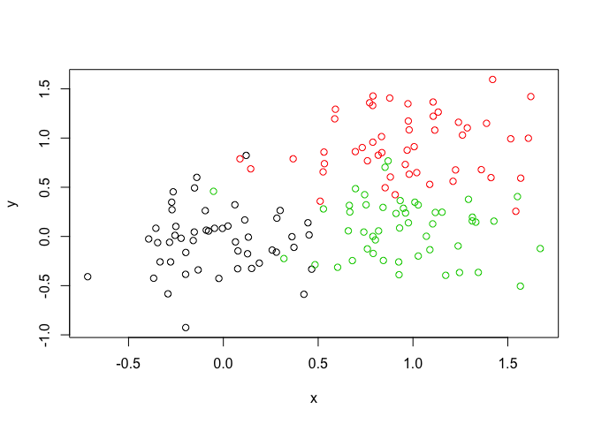

## K means clustering
Testing the 'kmeans()' function


```r
# Generate some example data for clustering. Making an object called tmp. rnorm pulls info from a normal distribution (eg, 30 numbers centered around -3 and one group centered around 3). Then cbind combines the tmp vector with the reverse of the tmp vector (x and y, respectively)
tmp <- c(rnorm(30,-3), rnorm(30,3))
x <- cbind(x=tmp, y=rev(tmp))
plot(x)
```

<!-- -->

# Use the kmeans() function setting k to 2 and nstart=20
Inspect/print the results
How many points are in each cluster?
Q. What ‘component’ of your result object details
 - cluster size?
# - cluster assignment/membership?
# - cluster center?
# Plot x colored by the kmeans cluster assignment and
# add cluster centers as blue points
# Q. Repeat for k=3, which one has the better total SS?


```r
km <- kmeans(x, centers = 2, nstart = 20)
km
```

```
## K-means clustering with 2 clusters of sizes 30, 30
## 
## Cluster means:
##           x         y
## 1  2.902454 -3.498120
## 2 -3.498120  2.902454
## 
## Clustering vector:
##  [1] 2 2 2 2 2 2 2 2 2 2 2 2 2 2 2 2 2 2 2 2 2 2 2 2 2 2 2 2 2 2 1 1 1 1 1
## [36] 1 1 1 1 1 1 1 1 1 1 1 1 1 1 1 1 1 1 1 1 1 1 1 1 1
## 
## Within cluster sum of squares by cluster:
## [1] 63.26915 63.26915
##  (between_SS / total_SS =  90.7 %)
## 
## Available components:
## 
## [1] "cluster"      "centers"      "totss"        "withinss"    
## [5] "tot.withinss" "betweenss"    "size"         "iter"        
## [9] "ifault"
```


```r
plot(x, col=km$cluster, pch = 16)
points(km$centers, col = "blue", pch =15)
```

<!-- -->

##HEIRACHICAL CLUSTERING

This function is based on distance matrices that YOU provide. Dist() calculates Euclidean distances
First we need to calculate point (dis)similarity as the Euclidean distance between observations

```r
dist_matrix <- dist(x)
```


```r
class(dist_matrix)
```

```
## [1] "dist"
```

Note that view(dist_matrix) doesn't work because it is not a data frame. Convert the matrix to see the data structure of the distance matrix and find the dimensions (60 by 60). To view it as a dataframe, use asmatrix function. The dim tells us the dimensions of the matrix


```r
dim(as.matrix(dist_matrix))
```

```
## [1] 60 60
```

The hclust() function returns a hierarchical clustering model


```r
hc <- hclust(d = dist_matrix)
```


```r
#the print method is not so useful here. Tells you the function, type of distance, and number of things clustered, but not much else...
hc
```

```
## 
## Call:
## hclust(d = dist_matrix)
## 
## Cluster method   : complete 
## Distance         : euclidean 
## Number of objects: 60
```


```r
#tells you what it is, a heat cluster
class(hc)
```

```
## [1] "hclust"
```


```r
#plotting it gives you dendogram. Can we make sense of it...?
plot(hc)
abline(h=6, col ="red")
```

<!-- -->

Doe the numbers of the leaves make sense? These are the row names (1-60). Can see there are two main branhes. The first group is one to 30. The second group is 31-60. Therefore the tree is showing you the groups. The height tells you this distance and therefore how close they are. The shorter the branch, the closer the individual numbers are to eachother (note how the longest branches are between 1-30 and 31-60).

#Where to cut the tree?
Let's cut our tree to define the clusters


```r
grps <- cutree(hc, h=6)
table(grps)
```

```
## grps
##  1  2 
## 30 30
```

```r
#tells you how many are in grps if you define the clusters by cut tree function
```


```r
plot(x, col=grps)
```

<!-- -->

Try different cutting...now using k isntead of h, to tell it to cut the tree such that four groups defines (previously, we told it to cut at height of 6, where we saw two groups formed by looking at the tree)


```r
plot(x, col=cutree(hc, k=4))
```

<!-- -->

##Using different hierarchical clustering methods to ensure the method doesn't skew our conclusions
hc.complete <- hclust(d, method="complete")
hc.average <- hclust(d, method="average")
hc.single <- hclust(d, method="single")

###Trying some examples (from the ppt slides)

##Step 1. Generate some example data for clustering


```r
x <- rbind(
matrix(rnorm(100, mean=0, sd = 0.3), ncol = 2), # c1
matrix(rnorm(100, mean = 1, sd = 0.3), ncol = 2), # c2
matrix(c(rnorm(50, mean = 1, sd = 0.3), # c3
rnorm(50, mean = 0, sd = 0.3)), ncol = 2))
colnames(x) <- c("x", "y")
```

##Step 2. Plot the data without clustering. Yields a dot plot of the data, hariball-ish...


```r
plot(x)
```

<!-- -->

##Step 3. Generate colors for known clusters (just so we can compare to hclust results)


```r
#asfactor colors the data? revisit this and re-explain.
col <- as.factor( rep(c("c1","c2","c3"), each=50) )
plot(x, col=col)
```

<!-- -->

##Q. Use the dist(), hclust(), plot() and cutree() functions to return 2 and 3 clusters


```r
#make a distance matrix first. Then cluster with the hclust fucntion
d <- dist(x)
hc <- hclust(d)
plot(hc)
```

<!-- -->

##Q. How does this compare to your known 'col' groups?
Can see that this creates two groups. Let's cut it into 2 groups? Or 3.


```r
grps <- cutree(hc, k=3)
table(grps)
```

```
## grps
##  1  2  3 
## 91 21 38
```

Plot the data colored by clusters (3, because we cut the tree to give 3 grps). 

```r
plot(x, col=grps)
```

<!-- -->

# PCA sections


```r
mydata <- read.csv("https://tinyurl.com/expression-CSV", row.names=1)

head(mydata)
```

```
##        wt1 wt2  wt3  wt4 wt5 ko1 ko2 ko3 ko4 ko5
## gene1  439 458  408  429 420  90  88  86  90  93
## gene2  219 200  204  210 187 427 423 434 433 426
## gene3 1006 989 1030 1017 973 252 237 238 226 210
## gene4  783 792  829  856 760 849 856 835 885 894
## gene5  181 249  204  244 225 277 305 272 270 279
## gene6  460 502  491  491 493 612 594 577 618 638
```

Ah, a problem. The 'prcomp()' function expects the observations to be rows and the variables to be columns. Therefore we need to first transpose our data.frame matrix with the t() transpose function. You can preview this as follows:


```r
#View(t(mydata))
#use this to see and organize by transposing,such that gene names now columns and wt vs KO conditions are the rows, useing the t() function
```


```r
## lets do PCA, remembering to transpose the dataframe
pca <- prcomp(t(mydata), scale=TRUE)
## See what is returned by the prcomp() function
attributes(pca)
```

```
## $names
## [1] "sdev"     "rotation" "center"   "scale"    "x"       
## 
## $class
## [1] "prcomp"
```

```r
#output will be:
# $names
#[1] "sdev" "rotation" "center" "scale" "x"
#
# $class
#[1] "prcomp"
```

SPit it out

```r
#pca
#not super useful, but at least shows some stuff
```

X is now ?


```r
## A basic PC1 vs PC2 2-D plot
plot(pca$x[,1], pca$x[,2])
```

<!-- -->

```r
## Variance captured per PC
pca.var <- pca$sdev^2
## Precent variance is often more informative to look at
pca.var <- pca$sdev^2
pca.var.per <- round(pca.var/sum(pca.var)*100, 1)
pca.var.per
```

```
##  [1] 92.6  2.3  1.1  1.1  0.8  0.7  0.6  0.4  0.4  0.0
```

MAke a plot of the variance

```r
barplot(pca.var.per, main="Scree Plot",
xlab="Principal Component", ylab="Percent Variation")
```

<!-- -->

Let's make this plot more useful. Color the PCA clusters


```r
#want these to color my plots by turning them into factors. BUT if I did as.factor on just this, would gie you 10 levels. Want to cut string into first two characters only to seperate out wt vs KO. 
colnames(mydata)
```

```
##  [1] "wt1" "wt2" "wt3" "wt4" "wt5" "ko1" "ko2" "ko3" "ko4" "ko5"
```

```r
substr(colnames(mydata), 1, 2 )
```

```
##  [1] "wt" "wt" "wt" "wt" "wt" "ko" "ko" "ko" "ko" "ko"
```

```r
mycols <- as.factor(substr(colnames(mydata), 1, 2 ))
plot(pca$x[,1], pca$x[,2], col=mycols, pch=16,
     xlab="PC1", ylab="PC2")
```

<!-- -->

An aside, about the paste function

```r
#want it to look like soemthing else. 
paste("Hello", "there")
```

```
## [1] "Hello there"
```

```r
paste("Hello", "there", "gene", 1:5)
```

```
## [1] "Hello there gene 1" "Hello there gene 2" "Hello there gene 3"
## [4] "Hello there gene 4" "Hello there gene 5"
```

Relabeling the axes with the past function


```r
#make a string to label the axis in place of PC or enhance it
plot(pca$x[,1], pca$x[,2], col=mycols, pch=16,
     xlab=paste0("PC1 (", pca.var.per[1], "%)"),
     ylab=paste0("PC2 (", pca.var.per[2], "%)"))
```

<!-- -->


```r
## A vector of colors for wt and ko samples. 
colvec <- colnames(mydata)
colvec[grep("wt", colvec)] <- "red"
colvec[grep("ko", colvec)] <- "blue"
plot(pca$x[,1], pca$x[,2], col=colvec, pch=16,
xlab=paste0("PC1 (", pca.var.per[1], "%)"),
ylab=paste0("PC2 (", pca.var.per[2], "%)"))
```

<!-- -->

There is more to finish in the slides exampe, return...


### Hands-on assignment

Looking at food data

```r
x <- read.csv("data/UK_foods.csv")
dim(x)
```

```
## [1] 17  5
```

```r
head(x)
```

```
##                X England Wales Scotland N.Ireland
## 1         Cheese     105   103      103        66
## 2  Carcass_meat      245   227      242       267
## 3    Other_meat      685   803      750       586
## 4           Fish     147   160      122        93
## 5 Fats_and_oils      193   235      184       209
## 6         Sugars     156   175      147       139
```

Uh oh. Looking at the dim output, we have 5 columns. We were expecting 4 columns (one for each of the 4 countries), and can see in the head output that there's and extra column of numbers. Lets fix this up with the following code, which sets the rownames() and then removes the troublesome first column (with the -1 column index)


```r
rownames(x) <- x[,1]
x <- x[,-1]
head(x)
```

```
##                England Wales Scotland N.Ireland
## Cheese             105   103      103        66
## Carcass_meat       245   227      242       267
## Other_meat         685   803      750       586
## Fish               147   160      122        93
## Fats_and_oils      193   235      184       209
## Sugars             156   175      147       139
```

Much better...Re-check the dimensions, gives us 4 columns, yay!

```r
dim(x)
```

```
## [1] 17  4
```

A cursory glance over the numbers in this table does not reveal much of anything. Indeed in general it is difficult to extract meaning from any given array of numbers. 

```r
#View(x)
```

Generating pairwise plots (see below) or a summary heatmap may help somewhat

```r
#par(mar=c(20, 4, 4, 2))
heatmap(as.matrix(x))
```

<!-- -->

In our example here, we have 17 dimensional data for 4 countries. We can thus ‘imagine’ plotting the 4 coordinates representing the 4 countries in 17 dimensional space. If there is any correlation between the observations (the countries), this will be observed in the 17 dimensional space by the correlated points being clustered close together, though of course since we cannot visualize such a space, we are not able to see such clustering directly


```r
#remember to transpose, so that the variables (food in this case) become the rows
pca <- prcomp( t(x) )
summary(pca)
```

```
## Importance of components:
##                             PC1      PC2      PC3       PC4
## Standard deviation     324.1502 212.7478 73.87622 4.189e-14
## Proportion of Variance   0.6744   0.2905  0.03503 0.000e+00
## Cumulative Proportion    0.6744   0.9650  1.00000 1.000e+00
```

The first task of PCA is to identify a new set of principal axes through the data. This is achieved by finding the directions of maximal variance through the coordinates in the 17 dimensional space. This is equivalent to obtaining the (least-squares) line of best fit through the plotted data where it has the largest spread. We call this new axis the first principal component (or PC1) of the data. The second best axis PC2, the third best PC3 etc.

The summary print-out above indicates that PC1 accounts for more than 67% of the sample variance, PC2 29% and PC3 3%. Collectively PC1 and PC2 together capture 96% of the origional 17 dimensional variance. Thus these first two new principal axis (PC1 and PC2) represent useful ways to view and further investigate our data set.

Lets start with a simple plot of PC1 vs PC2. In our food example here, the four 17 dimensional coordinates will be projected down onto the two principal components to obtain the graph below.


```r
plot(pca$x[,1], pca$x[,2], xlab="PC1", ylab="PC2", xlim=c(-270,500))
text(pca$x[,1], pca$x[,2], colnames(x))
```

<!-- -->

In this case approximately 67% of the variance in the data is accounted for by the first principal component, and approximately 97% is accounted for in total by the first two principal components. In this case, we have therefore accounted for the vast majority of the variation in the data using only a two dimensional plot - a dramatic reduction in dimensionality from seventeen dimensions to two.

Now we can use the square of pca$sdev , which stands for “standard deviation”, to calculate how much variation in the original data each PC accounts for.


```r
#the round() function rounds numbers
v <- round( pca$sdev^2/sum(pca$sdev^2) * 100 )
v
```

```
## [1] 67 29  4  0
```


```r
## or the second row here...cumulative proportion, therefore multiplied by 100 to get a % inthe above example
z <- summary(pca)
z$importance
```

```
##                              PC1       PC2      PC3          PC4
## Standard deviation     324.15019 212.74780 73.87622 4.188568e-14
## Proportion of Variance   0.67444   0.29052  0.03503 0.000000e+00
## Cumulative Proportion    0.67444   0.96497  1.00000 1.000000e+00
```

This information can be summarized in a plot of the variances (eigenvalues) with respect to the principal component number (eigenvector number), which is given below.


```r
barplot(v, xlab="Principal Component", ylab="Percent Variation")
```

<!-- -->


